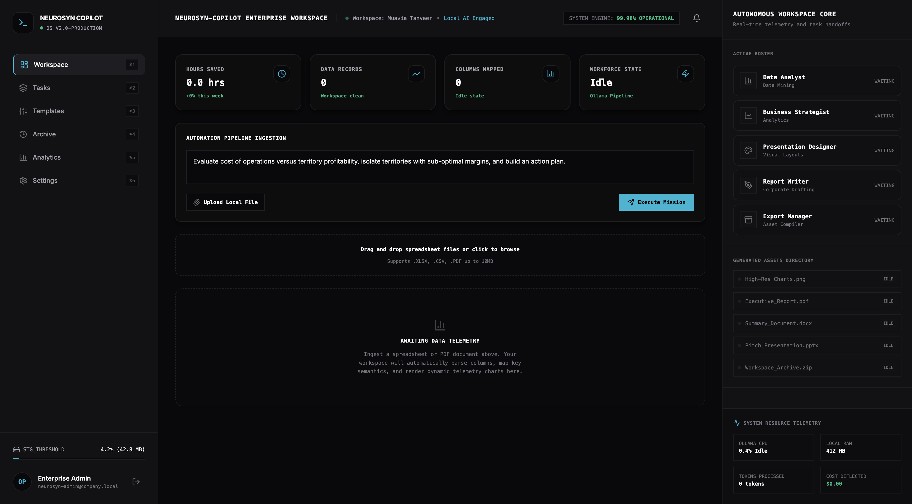
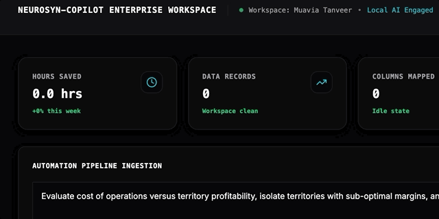
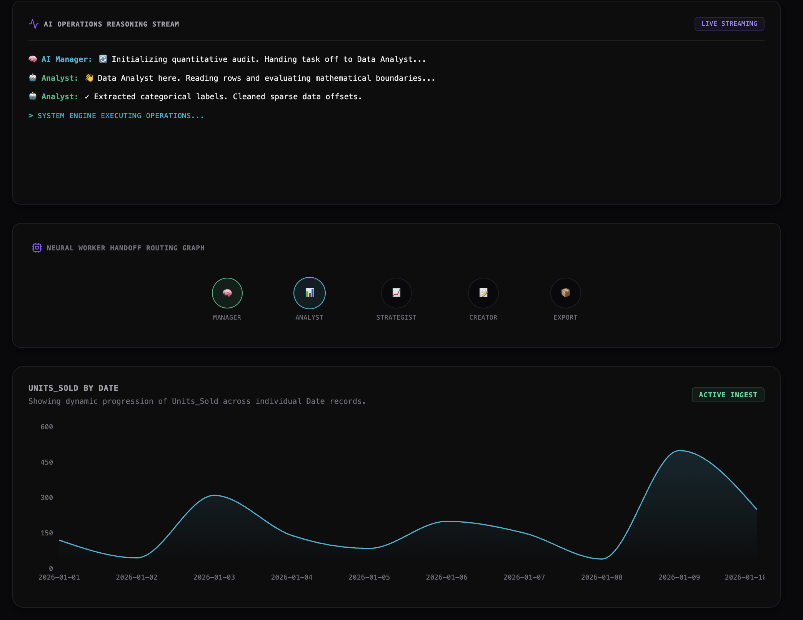
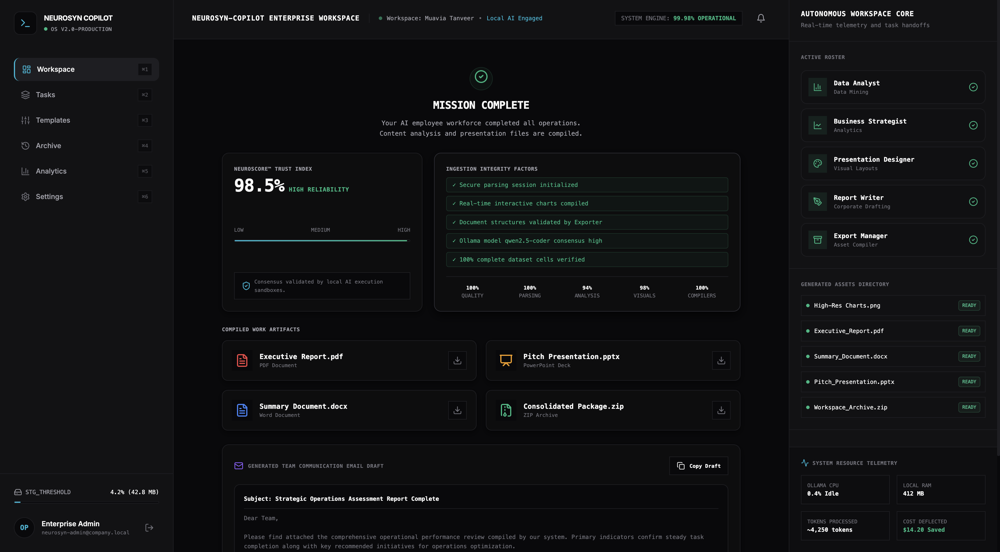
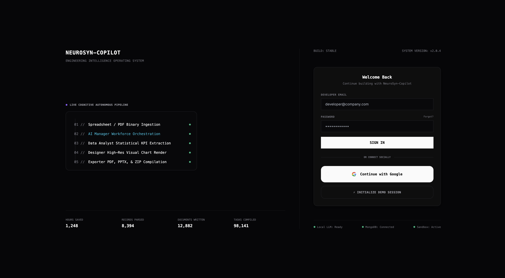
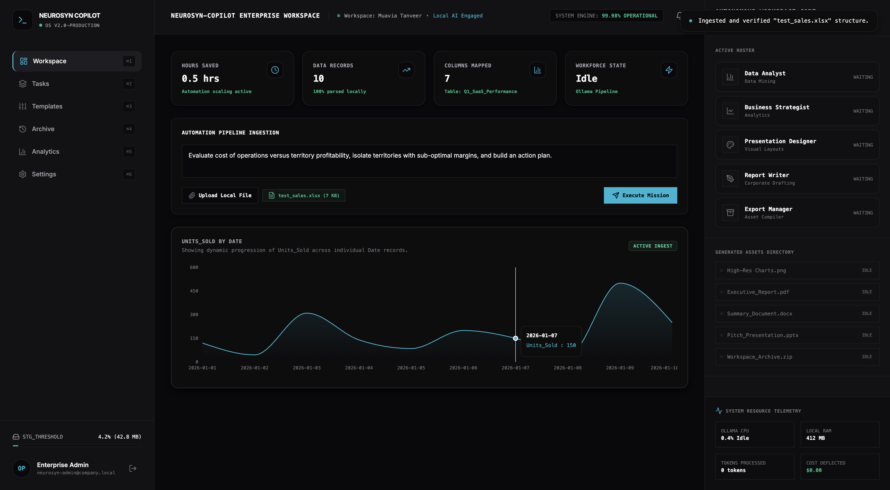
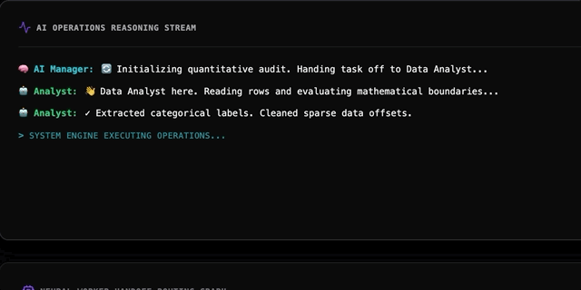
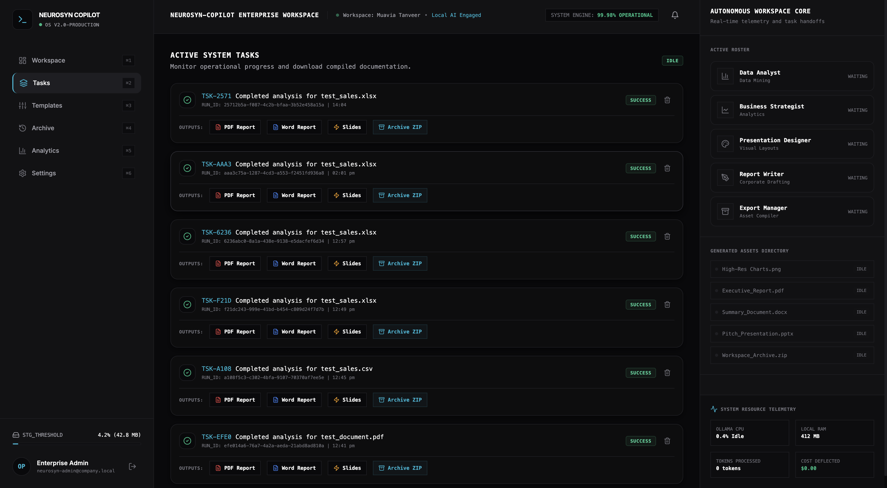
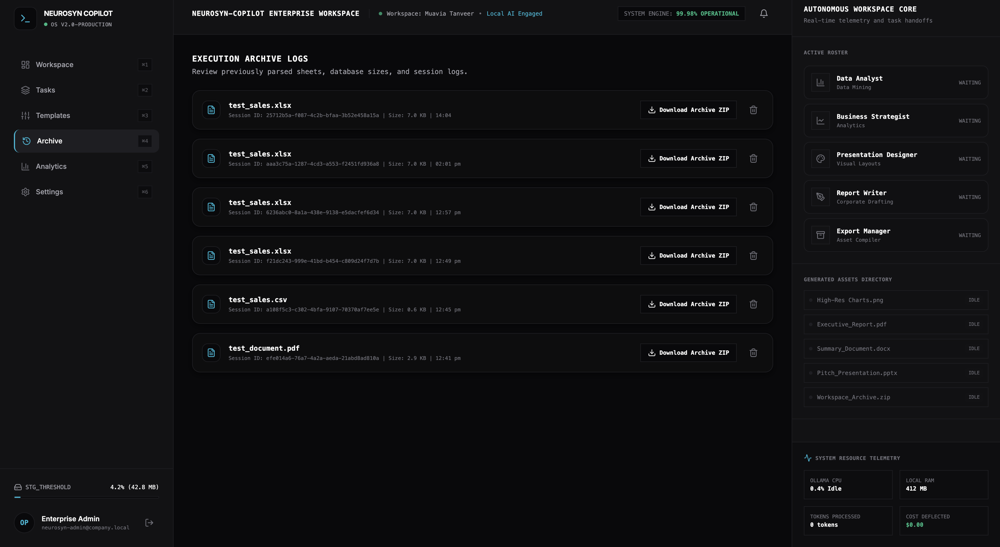

<!--
  SCREENSHOT CHECKLIST — drop files into ./assets/screenshots/ using the names below
  (or edit the image paths in this file to match whatever you name them).
  You can delete this comment block once every screenshot is in place.

  1. hero-dashboard.png       → main workspace, sidebar + orchestration graph visible
  2. handoff-graph.gif        → the animated agent handoff graph (GIF strongly preferred)
  3. reasoning-stream.png     → terminal console mid-conversation, 3-4 lines of dialogue visible
  4. neuroscore-card.png      → the NeuroScore card, with at least one warning badge showing
  5. demo-1-login.png         → Demo step 1: LoginPage v3.0
  6. demo-2-data.png          → Demo step 2: dashboard after test_sales.xlsx is ingested
  7. demo-3-orchestration.gif → Demo step 3: orchestrator graph + reasoning stream lighting up
  8. demo-4-pdf.png           → Demo step 4: dashboard after test_document.pdf is ingested
  9. demo-5-deliverables.png  → Demo step 5: Archive/history page with NeuroScore + downloads
-->

<a name="top"></a>

<div align="center">


⚡ 5 Autonomous Agents&nbsp;&nbsp;•&nbsp;&nbsp;🔒 100% Local Inference&nbsp;&nbsp;•&nbsp;&nbsp;📦 3 Export Formats&nbsp;&nbsp;•&nbsp;&nbsp;🧠 Zero Manual Prompting

<br/>

[](https://opensource.org/licenses/MIT)
[](https://www.mongodb.com/)
[](https://ollama.com/)
[](https://vitejs.dev/)

**[▶ Demo Video](https://github.com/Muaviatanveer/NeuroSyn-Copilot)** · **[🌐 Live Workspace](http://neurosyn-dev.onrender.com)** · **[📊 Pitch Deck](https://github.com/Muaviatanveer/NeuroSyn-Copilot)**

<br/>

<!-- 📸 SCREENSHOT 1 — HERO. Best single image/GIF of the product, ideally mid-task with the orchestration graph lit up. -->


</div>

<br/>

## 📑 Contents

<div align="center">

[](#why)
[](#problem)
[](#solution)
[](#roster)
[](#innovations)
[](#neuroscore)
[](#structure)
[](#stack)
[](#installation)
[](#demo)
[](#roadmap)
[](#team)
[](#license)

</div>

<br/>

<a name="why"></a>

## 🎯 Why NeuroSyn-Copilot?

Unlike traditional chat-based AI assistants that only output plain text blocks and require continuous manual prompting, NeuroSyn-Copilot operates as an orchestrated AI workforce.

By dragging and dropping a single corporate file, your AI Employees collaborate sequentially in the background — inspecting data structures, identifying anomalies, plotting metrics, drafting executive summaries, and compiling vector presentation decks. The system delivers finished, professional, download-ready administrative assets directly to your local workspace within minutes.

<a name="problem"></a>

## ⚠️ The Problem

Every office employee and financial analyst spends hours on repetitive administrative tasks:

| Pain Point | What It Looks Like |
| :--- | :--- |
| **Data Wrangling** | Manually scrubbing, verifying, and mapping spreadsheet rows |
| **Thematic Summaries** | Sifting through unstructured multi-page PDFs to write summaries |
| **Asset Compilation** | Switching between Excel, Word, and PowerPoint to build executive briefings |
| **Visual Design** | Programmatically generating, scaling, and placing charts onto slides |

This friction leads to massive corporate overhead, cognitive fatigue, and hundreds of lost operational hours.

<a name="solution"></a>

## 💡 Our Solution

NeuroSyn-Copilot introduces an autonomous, user-segmented AI Workforce. From a single upload, the multi-agent framework executes parallel, specialized workloads:

```text
[ USER INGESTION ] ──▶ [ PARSER ] ──▶ [ COGNITIVE WORKFORCE ] ──▶ [ SECURE DELIVERABLES ]
                                         • Data Analyst              • Executive PDF Report
                                         • Business Strategist       • Word Briefing (.docx)
                                         • Presentation Designer     • PowerPoint Deck (.pptx)
                                         • Report Writer             • Consolidated ZIP
```

<a name="roster"></a>

## 🛠️ System Cognitive Workforce Roster

Five specialized logical agents replace a single, general-purpose LLM:

| Employee | Code Name | Primary Responsibility | Target Output |
| :--- | :--- | :--- | :--- |
| **AI Manager** | `Manager` | Scans inputs, maps intent, coordinates execution branches, handles terminal logs | Task Orchestration |
| **Data Analyst** | `Analyst` | Computes statistical ranges, averages, parses schemas, isolates data gaps | Quantitative Ingestion |
| **Business Strategist** | `Strategist` | Correlates revenue vs. costs, evaluates satisfaction metrics, writes action plans | Strategic Recommendations |
| **Report Writer** | `Writer` | Synthesizes formal administrative copy, drafts leadership communication | Corporate Briefings |
| **Presentation Designer** | `Designer` | Maps plot layouts, renders high-res charts, compiles vector slides | PowerPoint Decks & Visuals |
| **Export Manager** | `Exporter` | Collects artifacts, verifies paths, compiles compressed archives | Portable ZIP Containers |

<a name="innovations"></a>

## ⚡ Key Innovations & Visual "Wow" Moments

**1. AI Manager Handoff Graph**
A live, animated SVG neural graph directly framing the login experience — data flows visibly from agent to agent in real time.

<!-- 📸 SCREENSHOT 2 — capture as a GIF if you can; the motion is the actual "wow" moment. -->


**2. AI Operations Reasoning Stream**
A terminal-style console logging real-time agent dialogue (`Manager: "Assigning analysis..."` → `Analyst: "Task accepted. Isolating columns..."`), making background operations completely transparent.

<!-- 📸 SCREENSHOT 3 — capture the terminal mid-conversation, 3-4 lines of dialogue visible. -->


**3. Active Blueprint Design System**
A clean, developer-focused workspace theme built on deep charcoal backgrounds, dotted engineering grids, and razor-thin container borders inspired by Linear, Raycast, and Vercel.

**4. Schema-Agnostic Semantic Ingestion**
The dashboard automatically adapts to file type — spreadsheets plot continuous numerical curves, PDFs trigger keyword frequency analytics.

<a name="neuroscore"></a>

## ⭐ NeuroScore™ Confidence Engine

To establish trust and prevent arbitrary percentage assignments, the workspace calculates accuracy using a weighted formula:

> **NeuroScore = 0.30 × Q + 0.20 × P + 0.20 × A + 0.15 × V + 0.15 × C**

| Factor | Weight | Measures |
| :--- | :--- | :--- |
| **Q** — Data Quality | 30% | Missing rows/empty cells (deducts 1% per empty cell) |
| **P** — Parsing Integrity | 20% | Whether document headers and buffers compile cleanly |
| **A** — Model Consensus | 20% | Local LLM response formatting consistency |
| **V** — Visuals Accuracy | 15% | Whether charts rendered as valid high-res coordinate plots |
| **C** — Compiler Success | 15% | Whether ZIP/PDF structures resolved with zero write errors |

If anomalies are detected, the score drops dynamically and warning badges are appended to the scorecard:

```text
✓ Ingested parsed successfully
✓ Successfully rendered 2 charts
⚠ 12 empty cell records detected and safely patched
```

<!-- 📸 SCREENSHOT 4 — capture the actual NeuroScore card, including at least one warning badge. -->


<a name="structure"></a>

## 📂 Repository Structure

```text
NeuroSyn-Copilot/
├── backend/
│   ├── agents/          # Cognitive workforce AI agents (analyst, writer, visualizer)
│   ├── api/              # Express endpoints (upload, execute, history, auth)
│   ├── generators/       # Document compiler engines (PDFKit, docx, pptxgenjs)
│   ├── parsers/          # Raw data parsers (ExcelJS, pdf-parse, CSV line parsers)
│   ├── services/         # State managers and MongoDB dbServices
│   ├── utils/            # Database connection poolers and diagnostic loggers
│   ├── app.js            # Central server entry point
│   └── package.json      # Backend dependencies
└── frontend/
    ├── public/            # Static assets (favicon, logo.png)
    ├── src/
    │   ├── components/    # Layout modules (Sidebar, MetricsDashboard, Timeline, Success)
    │   ├── App.jsx        # Central client coordinator & Event-Stream handler
    │   ├── index.css      # Blueprint backdrop variables & keyframe animations
    │   └── main.jsx       # DOM bootstrapper
    ├── tailwind.config.js # Custom border-radius and grid parameters
    ├── vite.config.js     # Dev-server API proxy routes (ports 3000 → 5001)
    └── package.json       # Frontend dependencies
```

<a name="stack"></a>

## 🧩 Complete Technical Stack

<table>
<tr>
<td valign="top" width="50%">

**Frontend**
- React (v18) — declarative rendering
- Tailwind CSS — layout & utility classes
- Framer Motion — hardware-accelerated animation
- Recharts — Area/Bar/Pie plotting panels
- Lucide React — monochrome icon set
- Canvas Confetti — task-completion flourish

**Backend & Parsing**
- NodeJS (v25) & Express — routing, event-stream broadcasting
- MongoDB & Native Driver — session/task persistence
- Multer — multipart file ingestion
- ExcelJS — structured workbook parsing
- PDF-Parse — buffer-based PDF parsing

</td>
<td valign="top" width="50%">

**Document Compilers**
- PDFKit — custom PDF builder
- docx — OOXML-compliant Word generator
- pptxgenjs — editable vector slide builder
- Chart.js To Image — headless PNG rendering
- Adm-Zip — local folder zipper

**Local AI Engine**
- Ollama — low-latency local inference
- Qwen2.5-Coder (7B) — optimized for structured JSON & code tasks

</td>
</tr>
</table>

<a name="installation"></a>

## 🚀 Local Installation & Verification

Follow these steps to run the workspace on macOS.

<details>
<summary><strong>1. Prerequisite — Local MongoDB & Ollama</strong></summary>

```bash
# Verify MongoDB is running locally
brew services start mongodb-community

# Start your local model engine
ollama run qwen2.5-coder:7b
```

</details>

<details>
<summary><strong>2. Configure Backend</strong></summary>

```bash
cd backend
npm install
```

```bash
# Write your environment configuration
cat > .env << 'EOF'
PORT=5001
LOCAL_LLM_BASE_URL=http://localhost:11434/v1
LOCAL_LLM_MODEL=qwen2.5-coder:7b
MONGODB_URI=mongodb://127.0.0.1:27017/neurosyn
EOF
```

```bash
# Generate high-fidelity test data files
node generate_all_test_data.js

# Start the server
npm run dev
```

</details>

<details>
<summary><strong>3. Configure Frontend</strong></summary>

```bash
cd ../frontend
npm install
npm run dev
```

Open [http://localhost:3000](http://localhost:3000) in your browser.

</details>

<details>
<summary><strong>4. Database Verification (mongosh CLI)</strong></summary>

```bash
mongosh
```

```javascript
use neurosyn
show collections // Expected output: files, history, users
db.users.find()   // Verify authorized profiles
```

</details>

<a name="demo"></a>

## 🎭 Live 3-Minute Hackathon Demo Script

| Time | Step | What To Show |
| :--- | :--- | :--- |
| 0:00–0:30 | **Entry Point** | LoginPage v3.0 — this is a gateway, not a landing page. Show the AI workforce standby nodes, scrolling logs, and local DB status indicator. Click **Initialize Demo Session** or **Continue with Google**. |
| 0:30–1:15 | **Ingesting Flat Data** | Drag in `test_sales.xlsx`. Show the metrics graph auto-titling itself "UNITS_SOLD BY DATE" from real, unhardcoded columns. |
| 1:15–2:00 | **Collaborative Flow** | Type "Analyze Q1 sales deficits and compile deliverables" → **Execute Mission**. The Orchestrator Graph lights up node-by-node as the Reasoning Stream prints live agent handoffs. |
| 2:00–2:30 | **Ingesting PDF** | Upload `test_document.pdf`. Graph switches to "RELEVANCE BY KEYWORD" as the parser extracts text frequencies — proving hybrid file support. |
| 2:30–3:00 | **Deliverables** | Open Archive/Success. Show the **NeuroScore™ (96.4%)** card and warning checklist, then download the `.pptx`, `.pdf`, and email draft. |

<!-- 📸 SCREENSHOTS 5–9 — one per row above, in order: demo-1-login.png, demo-2-data.png, demo-3-orchestration.gif, demo-4-pdf.png, demo-5-deliverables.png -->
<p float="left">
  
  
  
  
  
</p>

<a name="roadmap"></a>

## 🗺️ Strategic Roadmap

- [ ] **ERP Database Connectors** — native, secure pipelines into SAP, Oracle, and Salesforce APIs
- [ ] **Continuous Cron Audits** — scheduled background checks that generate, email, and archive executive briefs automatically
- [ ] **Fine-Tuned Custom Workforce** — let admins upload corporate guidelines to custom-train local models

<a name="team"></a>

## 👥 Core Project Team

**Muavia Tanveer** — Full-Stack AI Engineer & UI Architect
[GitHub](https://github.com/Muaviatanveer) · [LinkedIn](#)

<a name="license"></a>

## 📄 License

Licensed under the MIT License — see [LICENSE](./LICENSE) for details.

<br/>

<div align="center">

⭐ If NeuroSyn-Copilot saved you hours, consider starring the repo.

<a href="#top">↑ Back to top</a>


</div>
